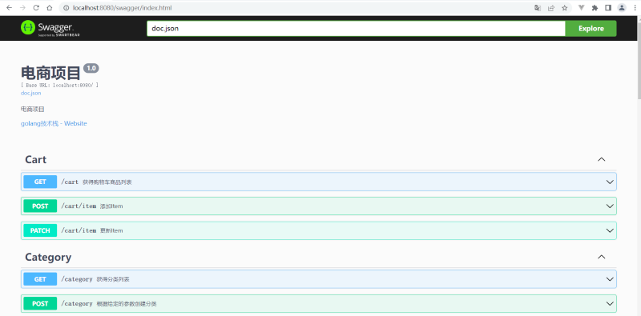

# shopping
## docker 使用方法
下载项目并将终端定位到项目文件夹下
docker 事先安装mysql，并将config/config.yaml中的账号和密码修改，在数据库中创建新数据库名为go_database.\
运行以下命令\
`docker build -t shopping:v1 .`
`docker run --name shopping --link mysql -dp 8080:8080 shopping:v1
`

打开浏览器输入：http://localhost:8080/swagger/index.html，运行结果如下所示：
